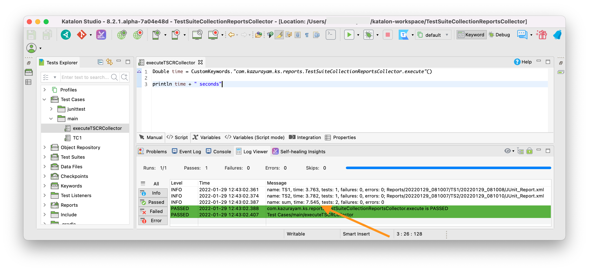

= TestSuiteCollection Reports Collector
@author kazurayam
@date 29 Jan 2022

This is a Katalon Studio project where I developed a jar file `com.kazurayam.ks.reports.TestSuiteCollectionCollector-x.x.x.jar`.


This jar provides a Custom Keyword operational in any Katalon Studio project. It can display the total execution time of a Test Suite Collection executuion in seconds.


This Custom Keyword was developed to propose a solution to a question raised in the Katalon User Forum:

- https://forum.katalon.com/t/execution-start-end-date-time-and-duration-of-test-suite-collection/62027[Execution start end date time and duration of test suite collection]

This project was developed using Katalon Studio v8.2.1. I haven't tested other versions. But the Custom Keyword would run on recent version since v8.x, maybe on v7.x as well.

== Problem to solve

Katalon Studio provides a feature called "Test Suite Collection". A Test Suite Collection is a collection of multiple Test Suites. You can execute the Test Suites as one batch by executing the Test Suite Collection. 

Let me present an example. I have a Katalon Studio project where I have 2 Test Suites: `TS1` and `TS2`. And I have a Test Suite Collection named `TSC`. When I ran `TSC`, it generated outputs in the `Reports` folder, for example as follows:

```
$ cd Reports
:~/tmp/TestSuiteCollectionReportsCollector/Reports (master *)
$ tree .
.
├── 20220129_104341
│   ├── TS1
│   │   └── 20220129_104343
│   │       ├── 20220129_104343.csv
│   │       ├── 20220129_104343.html
│   │       ├── JUnit_Report.xml
│   │       ├── execution.properties
│   │       ├── execution.uuid
│   │       ├── execution0.log
│   │       ├── testCaseBinding
│   │       └── tsc_id.txt
│   ├── TS2
│   │   └── 20220129_104345
│   │       ├── 20220129_104345.csv
│   │       ├── 20220129_104345.html
│   │       ├── JUnit_Report.xml
│   │       ├── execution.properties
│   │       ├── execution.uuid
│   │       ├── execution0.log
│   │       ├── testCaseBinding
│   │       └── tsc_id.txt
│   └── TSC
│       └── 20220129_104341
│           └── 20220129_104341.rp
└── Self-healing
    └── broken-test-objects.json

8 directories, 18 files
```

In the `Reports/20220129_104341/TS1/20220129_104343/JUnit_Report.xml` file, I found:
```
<testsuites name="TS1" time="3.763" tests="1" failures="0" errors="0">

```

In the `Reports/20220129_104341/TS2/20220129_104345/JUnit_Report.xml` file, I found: 
```
<testsuites name="TS2" time="3.782" tests="1" failures="0" errors="0">
```

But I could not find the sum of TS1 and TS2 duration. I had to manually calculate it. It was a poor experience.

== Solution

I have developed a Custom Keyword. It looks into the `Reports` folder, identify the latest Test Suite Execution (TSC for short), find the `JUnitReport.xml` files of the Test Suites executed in the TSC, calculate the duration of the TSC in seconds, display the duration in the console. For example



This would be useful especially when a TSC contains many Test Suites and each Test Suites take long time to finish.

== Description

* It is assumed that you already have a Katalon Studio project with a Test Suite Collection.
* download the the jar file of `TestSuiteCollectionReportsCollector` from the https://github.com/kazurayam/TestSuiteCollectionReportsCollector/releases[Releases] page.
* locate the jar file into the `Drivers` folder of your project
* Stop and retart Katalon Studio to let it acknowledge the new jar. Re-open the project.
* make a Test Case script of any name, that calls the custom keyword. See the sample code.
[source, groovy]
----
include::Scripts/main/executeTSCRCollector/Script1643416781935.groovy[]
----
* Execute your Test Suite Collection.
* After the TSC, run the test case script, which will display the total duration of the TSC.
